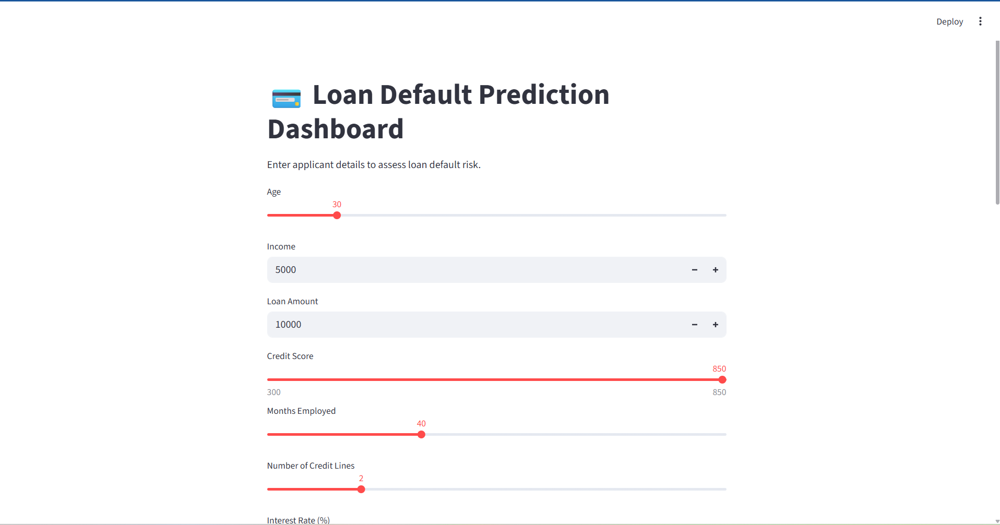
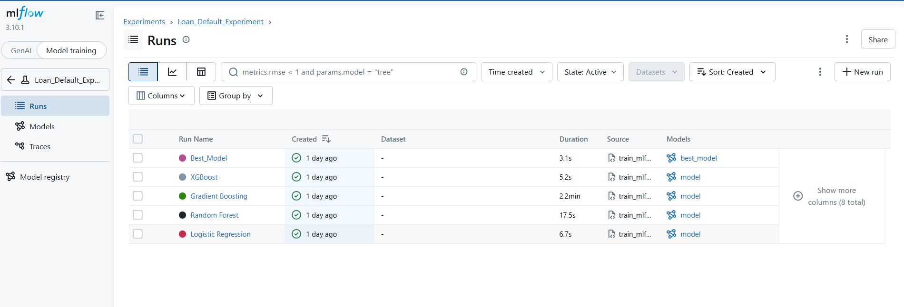

## Overview

This project is a **production-ready machine learning system** for predicting loan default risk. It goes beyond traditional modeling by integrating:

* Data preprocessing
* Model selection and tuning
* Class imbalance handling
* Experiment tracking with MLflow
* API deployment using FastAPI
* Interactive dashboard using Streamlit

The system allows users to input borrower details and receive:

* Default prediction (0 or 1)
* Probability of default
* Risk classification based on adjustable thresholds

---

## Project Visuals

###  Interactive Dashboard



*Figure 1: Streamlit dashboard enabling real-time prediction and threshold tuning.*

---

### MLflow Experiment Tracking



*Figure 2: MLflow UI showing experiment tracking, model comparison, and metrics.*

---

### Model Comparison


*Figure 3: Performance comparison across models using ROC-AUC and F1-score.*

---

## Problem Statement

Financial institutions need robust tools to identify high-risk borrowers and reduce loan default losses.

This system provides a **data-driven decision support tool** that:

* Predicts default risk
* Handles imbalanced datasets
* Supports business-driven threshold tuning

---

## Tech Stack

* **Python**
* **Pandas, NumPy**
* **Scikit-learn, XGBoost**
* **Imbalanced-learn (SMOTE)**
* **MLflow (Experiment Tracking + Model Registry)**
* **FastAPI (Backend API)**
* **Streamlit (Frontend UI)**
* **Matplotlib, Seaborn (Visualization)**

---

## Key Features

###  1. Data Pipeline

* Data cleaning and preprocessing
* Feature engineering
* Consistent transformation using saved preprocessing pipeline

---

### 2. Exploratory Data Analysis (EDA)

* Target distribution analysis
* Feature distributions
* Correlation heatmap
* Default rate by category
* Saved visual reports in `/reports`

---

###  3. Model Development

Models trained and compared:

* Logistic Regression
* Random Forest
* Gradient Boosting
* XGBoost

#### ✔ Techniques Used:

* Stratified K-Fold Cross Validation
* GridSearchCV for hyperparameter tuning
* Evaluation metrics: ROC-AUC, Precision, Recall, F1

---

### 4. Handling Class Imbalance

* SMOTE (Synthetic Minority Oversampling Technique)
* Improved recall from ~0.03 → ~0.69

---

### 5. Threshold Optimization

* Dynamic threshold tuning (0.1 → 0.85)
* Enables business-specific decision strategies:

| Strategy     | Goal                   | Threshold     |
| ------------ | ---------------------- | ------------- |
| Risk-Averse  | Catch defaulters       | Low (0.1–0.3) |
| Balanced     | Trade-off              | ~0.5          |
| Conservative | Reduce false positives | High (0.7+)   |

---

### 6. MLflow Integration

* Experiment tracking
* Metric logging (ROC-AUC, Precision, Recall, F1)
* Artifact logging (confusion matrices)
* Model Registry (`LoanDefaultModel`)

---

### 7. API Deployment (FastAPI)

Real-time prediction endpoint:

```http
POST /predict
```

#### Example Input:

```json
{
  "Age": 45,
  "Income": 60000,
  "LoanAmount": 15000,
  "CreditScore": 650,
  "MonthsEmployed": 24,
  "NumCreditLines": 3,
  "InterestRate": 12.5,
  "LoanTerm": 36,
  "DTIRatio": 0.4,
  "Education": "Bachelor's",
  "EmploymentType": "Full-time",
  "MaritalStatus": "Married",
  "HasMortgage": "Yes",
  "HasDependents": "No",
  "LoanPurpose": "Personal",
  "HasCoSigner": "No"
}
```

#### Example Output:

```json
{
  "prediction": 0,
  "probability": 0.048
}
```

---

### 8. Interactive Dashboard (Streamlit)

* User-friendly interface
* Real-time predictions
* Probability score visualization
* Adjustable threshold slider
* Business-friendly output (High Risk / Low Risk)

---

## Model Performance

| Model               | ROC-AUC | Recall       | Precision        |
| ------------------- | ------- | ------------ | ---------------- |
| Logistic Regression | ~0.75   | ~0.69        | ~0.22            |
| XGBoost             | ~0.75   | Lower recall | Higher precision |

### Key Insight:

> Handling class imbalance significantly improved model performance and real-world usability.

---

## Business Insights

* Lower credit scores strongly correlate with default risk
* Higher debt-to-income ratios increase default probability
* Employment stability significantly impacts risk
* Threshold tuning enables flexible lending strategies

---

##  System Architecture

```
Streamlit UI → FastAPI → MLflow Model → Prediction
```

---

## How to Run the Project

### 1. Start FastAPI Backend

```bash
cd A1-loan-default-pipeline/src/api
python -m uvicorn app:app --reload
```

### 2. Start Streamlit Dashboard

```bash
streamlit run A1-loan-default-pipeline/src/dashboard/app.py
```

---

## Key Learnings

* Handling imbalanced datasets is critical in real-world ML
* Model evaluation must align with business goals
* MLflow enables reproducibility and experiment tracking
* Deployment transforms models into usable systems
* End-to-end ML systems require integration across multiple tools

---

## Future Improvements

* SHAP explainability for model transparency
* Docker containerization
* Cloud deployment (AWS / Azure / GCP)
* Real-time data streaming

---

